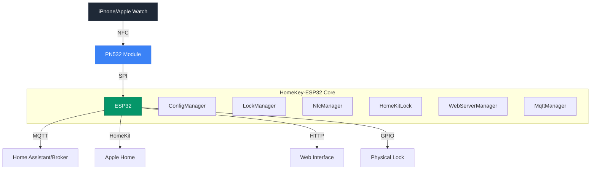

<div align="center">
  

  # HomeKey-ESP32
  [](https://discord.com/invite/VWpZ5YyUcm)
  [](https://github.com/rednblkx/HomeKey-ESP32/actions/workflows/esp32.yml)
  [](LICENSE)
  
  **Apple HomeKey functionality for the rest of us**
  

  [Documentation](https://rednblkx.github.io/HomeKey-ESP32/) • [Quick Start](#-60-second-quick-start) • [Setup Guide](docs/setup.md) • [Discord](https://discord.com/invite/VWpZ5YyUcm)

</div>

## What is HomeKey-ESP32?

The project aims to be the easy DIY solution for using Apple's HomeKey feature without the need to purchase a compatible smart lock that you probably don't want. HomeKey-ESP32 brings Apple's secure NFC-based unlocking to an ESP32 module near you, enabling you to unlock doors and whatnot with a simple tap of your iPhone or Apple Watch.

**No proprietary hardware required** – just an ESP32 and a PN532 NFC module

> [!WARNING]
> The flash memory is not encrypted as this kinda started as a pet project of mine but a lot of people started using
> so unfortunately it's stuck like this because migration would be painful and i don't want to be telling people to
> reconfigure their device if they want to update.
>
> If you care about this, i'm working on a new project implementing the new Aliro standard and flash will be
> encrypted first thing, however, honestly don't know when that will be public, you can join the Discord server
> if you want to know as soon as it is available.

## Getting Started

### Prerequisites

- **ESP32 Development Board**
- **PN532 NFC Module** (SPI interface)
- **USB Cable** (for flashing and power)
- **Computer** (Windows, Mac, or Linux)
- **Basic Electronics Knowledge** (not a problem if you're new to this, ask away!)

#### Ethernet

The following chips are supported for Ethernet:

-  W5500
-  DM9051
-  KSZ8851
-  LAN8720 / LAN8710
-  TLK110
-  RTL8201
-  DP83848
-  KSZ8041
-  KSZ8081

> [!IMPORTANT]
>
> The following are only supported for ESP32-WROOM-32 boards as other variants lack the internal EMAC needed for the RMII interface:
> -  LAN8720 / LAN8710
> -  TLK110
> -  RTL8201
> -  DP83848
> -  KSZ8041
> -  KSZ8081

### Installation Steps

1. **Download Firmware**
   - Visit [GitHub Releases](https://github.com/rednblkx/HomeKey-ESP32/releases/latest)
   - Download the `*.firmware.factory.bin` file
   - This contains everything you need - no compilation required!

2. **Connect Your Hardware**
   - Wire your PN532 NFC module to your ESP32 using the default pins
   - Refer to the [detailed wiring guide](https://rednblkx.github.io/HomeKey-ESP32/setup/#21-nfc-module-wiring) for your specific setup

3. **Flash the Firmware**
   ```bash
   # Install esptool (one-time setup)
   pip install esptool
   
   # Flash the firmware (replace YOUR_PORT)
   esptool.py --port /dev/ttyUSB0 write_flash 0x0 firmware.factory.bin
   ```
   
   **Prefer a GUI?** Use the [browser-based flasher](https://espressif.github.io/esptool-js/) - no command line needed!

4. **Initial Setup**
   - Connect to the device's WiFi AP (`HomeSpan-Setup` / `homespan`)
   - Access the web interface at `http://192.168.4.1`
   - Configure your WiFi credentials and HomeKit setup code
   - Pair with Apple Home using code: `466-37-726`

5. **Start Using HomeKey!**
   - Hold your iPhone or Apple Watch near the NFC reader
   - Enjoy instant, secure access to your home! 🎉

## System Architecture

<div align="center">
  


</div>

## ✨ Key Features

### **Apple HomeKey Integration**
- **Express Mode**: Unlock without waking your device
- **Power Reserve**: Unlock even when the device needs to be charged
- **Multi-Device Support**: Works with iPhone and Apple Watch
- **Fast Authentication**: Sub-300ms unlock times

### **Smart Home Ready**
- **HomeKit Native**: Full Apple Home ecosystem integration
- **MQTT Support**: Connect to Home Assistant, OpenHAB, and other platforms
- **Home Assistant Discovery**: Automatic device detection and configuration
- **Custom States**: Support for complex lock states (jamming, unlocking, etc.)

### **Modern Web Interface**
- **Svelte Frontend**: Responsive, modern UI built with Svelte 5 + Tailwind CSS
- **Real-time Updates**: WebSocket-powered live status updates
- **OTA Updates**: Over-the-air firmware updates via web interface
- **Configuration Management**: Easy setup without recompiling

### **Developer Friendly**
- **Open Source**: MIT licensed, community-driven development
- **Modular Architecture**: Clean separation of concerns
- **Event System**: Pub/sub architecture for extensibility
- **Comprehensive Logging**: Debug and monitor with detailed logs

## Development

```mermaid
graph TD
  %% External Systems & Hardware
  subgraph "External World"
      A[iPhone / Apple Watch]
      B[Apple Home]
      C[Web Browser]
      D[MQTT Broker]
      E[Physical Lock, Buttons & LEDs]
  end

  %% Main Application on ESP32
  subgraph "HomeKey-ESP32 Core"
      
      subgraph "Interface Managers (I/O)"
          direction LR
          Nfc[NfcManager]
          HK[HomeKitLock]
          Web[WebServerManager]
          Mqtt[MqttManager]
          Hw[HardwareManager]
      end

      subgraph "Logic Core (State Machine)"
          Lock[LockManager]
      end

      subgraph "Data Services (Persistence)"
          direction LR
          Config[ConfigManager]
          Reader[ReaderDataManager]
          NVS[(NVS Storage)]
      end

      %% High-level Data and Control Flow
      DataServices[Data Services] -- "Provides Config & Reader Data" --> InterfaceManagers[Interface Managers]
      DataServices -- "Provides Config" --> LogicCore[Logic Core]
      Config -- "Reads/Writes" --> NVS
      Reader -- "Reads/Writes" --> NVS
      
      InterfaceManagers -- "State Change Requests (e.g., Unlock)" --> Lock
      Lock -- "Actions & State Updates" --> InterfaceManagers
  end
  
  %% Connections to the External World
  A -- NFC --> Nfc
  B -- HomeKit --> HK
  C -- HTTP/WebSocket --> Web
  D -- MQTT --> Mqtt
  E -- GPIO --> Hw
  
  Hw -- GPIO --> E
  HK -- HomeKit --> B
  Web -- HTTP/WebSocket --> C
  Mqtt -- MQTT --> D

  %% Styling for clarity
  style A fill:#1f2937,stroke:#374151,color:#fff
  style B fill:#1f2937,stroke:#374151,color:#fff
  style C fill:#1f2937,stroke:#374151,color:#fff
  style D fill:#1f2937,stroke:#374151,color:#fff
  style E fill:#1f2937,stroke:#374151,color:#fff

  style Nfc fill:#3b82f6,stroke:#2563eb,color:#fff
  style HK fill:#059669,stroke:#047857,color:#fff
  style Web fill:#f59e0b,stroke:#d97706,color:#fff
  style Mqtt fill:#ef4444,stroke:#dc2626,color:#fff
  style Hw fill:#8b5cf6,stroke:#7c3aed,color:#fff

  style Lock fill:#ec4899,stroke:#db2777,color:#fff
  
  style Config fill:#6b7280,stroke:#4b5563,color:#fff
  style Reader fill:#6b7280,stroke:#4b5563,color:#fff
  style NVS fill:#9ca3af,stroke:#6b7280,color:#fff
```

<div align="center">
  


</div>

### Project Structure

```
HomeKey-ESP32/
├── main/                    # Core ESP32 application
│   ├── main.cpp            # Application entry point
│   ├── ConfigManager.cpp    # Configuration management
│   ├── ReaderDataManager.cpp # Reader data management
│   ├── NfcManager.cpp      # NFC communication
│   ├── HomeKitLock.cpp     # HomeKit integration
│   ├── LockManager.cpp     # Lock state management
│   ├── MqttManager.cpp     # MQTT client
│   ├── WebServerManager.cpp # Web interface
│   ├── WebSocketLogSinker.cpp # WebSocket logging sinker
│   ├── HardwareManager.cpp # Hardware manager
│   └── HKServices.cpp # HomeKit services
├── data/                   # Web interface files
│   ├── src/               # Vue.js application
│   └── index.html         # Web UI entry point
├── components/            # External dependencies
│   ├── HK-HomeKit-Lib/   # HomeKey implementation
│   ├── HomeSpan/         # HomeKit framework
│   └── PN532/            # NFC driver
└── docs/                 # Documentation
    └── content/          # Hugo documentation
```

### Core Components

| Component | File | Purpose |
|-----------|------|---------|
| **NFC Manager** | [`NfcManager.cpp`](main/NfcManager.cpp) | Handles PN532 communication and HomeKey authentication |
| **HomeKit Bridge** | [`HomeKitLock.cpp`](main/HomeKitLock.cpp) | Manages Apple HomeKit integration and pairing |
| **Lock Manager** | [`LockManager.cpp`](main/LockManager.cpp) | Controls lock state transitions and GPIO actions |
| **MQTT Client** | [`MqttManager.cpp`](main/MqttManager.cpp) | Enables smart home integration via MQTT |
| **Web Server** | [`WebServerManager.cpp`](main/WebServerManager.cpp) | Provides configuration UI and OTA updates |
| **Config Manager** | [`ConfigManager.cpp`](main/ConfigManager.cpp) | Handles persistent configuration storage |

### Building from Source

```bash
# Install dependencies
git submodule update --init --recursive

# Install esp-idf (see https://docs.espressif.com/projects/esp-idf/en/latest/esp32/get-started/index.html#get-started)

# Build firmware
idf.py build

# Flash to device
idf.py -p /dev/ttyUSB0 flash

# Monitor output
idf.py monitor
```

### Contributing

Contributions are welcomed! Please see the [Contributing Guidelines](CONTRIBUTING.md) for details.

1. Fork the repository
2. Create a feature branch (`git checkout -b feature/amazing-feature`)
3. Commit your changes (`git commit -m 'feat: Add amazing feature'`)
4. Push to the branch (`git push origin feature/amazing-feature`)
5. Open a Pull Request against the `main` branch

## Support the Project

HomeKey-ESP32 is openly developed and maintained by the community. Your support helps us continue improving the project.

- **Star the repository** to show your appreciation
- **Report bugs** to help improve stability
- **Suggest features** to guide development
- **Share the project** with your network
- **Contribute documentation** to help others

## Credits

- **[@kormax](https://github.com/kormax)**: Reverse-engineered the HomeKey NFC protocol and published the foundational [PoC implementation](https://github.com/kormax/apple-home-key-reader)
- **[@kupa22](https://github.com/kupa22)**: Researched the HAP (HomeKit Accessory Protocol) side of HomeKey
- **[HomeSpan](https://github.com/HomeSpan/HomeSpan)**: Excellent HomeKit framework that powers our integration
- **[ESP-IDF](https://github.com/espressif/esp-idf)**: Robust IoT development framework from Espressif

## License & Legal

### License

This project is licensed under the **MIT License** - see the [LICENSE](LICENSE) file for details.

### Disclaimer

**Important**: This project implements Apple HomeKey functionality through reverse engineering. While we strive for security and compatibility:

- **Not affiliated** in any shape or form nor condoned by Apple Inc.
- **Use at your own risk** for security-critical applications
- **May lack elements** from Apple's private specifications
- **Subject to change** as Apple updates their protocols

### Trademarks

- **Apple**, **iPhone**, and **Apple Watch** are trademarks of Apple Inc.
- **ESP32** is a trademark of Espressif Systems (Shanghai) Co., Ltd.
- **Home Assistant** is a trademark of Open Home Foundation
