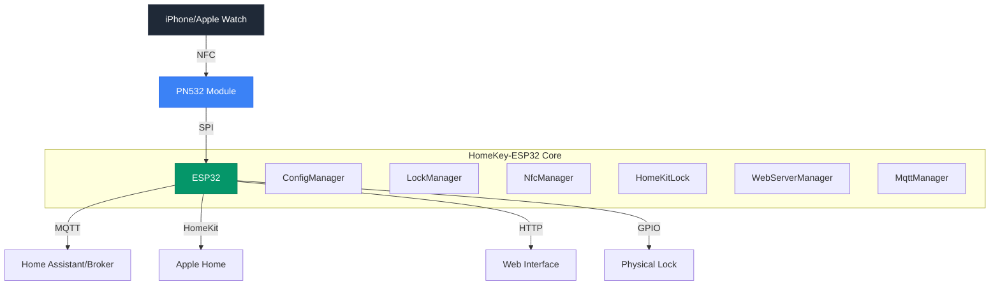

<div align="center">
  
  
  # HomeKey-ESP32 🏠🔑
  
  **Apple HomeKey functionality for the rest of us**
  
  [](https://discord.com/invite/VWpZ5YyUcm)
  [](https://github.com/rednblkx/HomeKey-ESP32/actions/workflows/esp32.yml)
  [](LICENSE)
  [](https://ko-fi.com/L3L2UCY8N)
  
  [📖 Documentation](https://rednblkx.github.io/HomeKey-ESP32/) • [🚀 Quick Start](#-60-second-quick-start) • [🛠️ Setup Guide](docs/setup.md) • [💬 Discord](https://discord.com/invite/VWpZ5YyUcm)
</div>

## What is HomeKey-ESP32?

Transform your ordinary door lock into a smart, Apple HomeKey-compatible access system. HomeKey-ESP32 brings Apple's secure NFC-based unlocking to any ESP32-powered device, enabling you to unlock doors with a simple tap of your iPhone or Apple Watch.

**No proprietary hardware required** – just an ESP32 and a PN532 NFC module

## ⚡ 60-Second Quick Start

```bash
# 1. Download firmware from GitHub Releases
# Visit: https://github.com/rednblkx/HomeKey-ESP32/releases/latest
# Download: *-firmware-merged.bin (depending on your board)

# 2. Install esptool.py
pip install esptool

# 3. Connect your ESP32 and flash
esptool.py --port /dev/ttyUSB0 write_flash 0x0 firmware-merged.bin

# 4. Connect to WiFi AP: HomeSpan-Setup / homespan
# 5. Configure at http://192.168.4.1
# 6. Pair with HomeKit using code: 466-37-726 (unless you changed it)
# 7. Start using HomeKey! 🎉
```

**Prefer a GUI?** Use the browser-based flasher at [esptool-js](https://espressif.github.io/esptool-js/) - no command line needed!

## 🏗️ System Architecture

<div align="center">
  


</div>

### Core Components

| Component | File | Purpose |
|-----------|------|---------|
| **NFC Manager** | [`NfcManager.cpp`](main/NfcManager.cpp) | Handles PN532 communication and HomeKey authentication |
| **HomeKit Bridge** | [`HomeKitLock.cpp`](main/HomeKitLock.cpp) | Manages Apple HomeKit integration and pairing |
| **Lock Manager** | [`LockManager.cpp`](main/LockManager.cpp) | Controls lock state transitions and GPIO actions |
| **MQTT Client** | [`MqttManager.cpp`](main/MqttManager.cpp) | Enables smart home integration via MQTT |
| **Web Server** | [`WebServerManager.cpp`](main/WebServerManager.cpp) | Provides configuration UI and OTA updates |
| **Config Manager** | [`ConfigManager.cpp`](main/ConfigManager.cpp) | Handles persistent configuration storage |

## ✨ Key Features

### **Apple HomeKey Integration**
- **Express Mode**: Unlock without waking your device
- **Secure Authentication**: Military-grade encryption via Apple Secure Element
- **Multi-Device Support**: Works with iPhone, Apple Watch, and other Apple devices
- **Fast Authentication**: Sub-500ms unlock times

### **Smart Home Ready**
- **HomeKit Native**: Full Apple Home ecosystem integration
- **MQTT Support**: Connect to Home Assistant, OpenHAB, and other platforms
- **Home Assistant Discovery**: Automatic device detection and configuration
- **Custom States**: Support for complex lock states (jamming, unlocking, etc.)

### **Modern Web Interface**
- **Vue.js Frontend**: Responsive, modern UI built with Vue 3 + Tailwind CSS
- **Real-time Updates**: WebSocket-powered live status updates
- **OTA Updates**: Over-the-air firmware updates via web interface
- **Configuration Management**: Easy setup without recompiling

### **Developer Friendly**
- **Open Source**: MIT licensed, community-driven development
- **Modular Architecture**: Clean separation of concerns
- **Event System**: Pub/sub architecture for extensibility
- **Comprehensive Logging**: Debug and monitor with detailed logs

## 📊 Performance Benchmarks

| Metric | Value | Notes |
|--------|-------|-------|
| **Authentication Time** | 150-250ms | End-to-end unlock |
| **NFC Detection Range** | 0-4cm | Optimal at 2-3cm |
| **Flash Usage** | 1.63MB | Total firmware size |
| **RAM Usage** | 181KB | DIRAM (40% of 452KB) on ESP32-C6 |
| **Free Heap** | ~271KB | Available for runtime on ESP32-C6 |
| **Power Consumption** | 150-200mA | During active NFC polling |

## 🚀 Getting Started

### Prerequisites

- **ESP32 Development Board** (4MB+ flash recommended)
- **PN532 NFC Module** (SPI interface)
- **USB Cable** (for flashing and power)
- **Computer** (Windows, Mac, or Linux)
- **Basic Electronics Knowledge** (wiring and safety)

### Hardware Requirements

<div align="center">

| Component | Recommended | Alternative |
|-----------|-------------|-------------|
| **ESP32** | ESP32-WROOM-32 | Any 4MB+ variant |
| **NFC Module** | PN532 SPI | PN532 I2C (currently not supported) |
| **Power Supply** | 5V 1A USB | 5V 0.5A minimum |
| **Wiring** | Jumper Wires | Soldered connections |

</div>

### Installation Steps

1. **Download Firmware**
   - Visit [GitHub Releases](https://github.com/rednblkx/HomeKey-ESP32/releases/latest)
   - Download the `*-firmware-merged.bin` file
   - This contains everything you need - no compilation required!

2. **Connect Your Hardware**
   - Wire your PN532 NFC module to your ESP32 using the default pins
   - Refer to the [detailed wiring guide](docs/content/setup.md#21-nfc-module-wiring) for your specific setup

3. **Flash the Firmware**
   ```bash
   # Install esptool (one-time setup)
   pip install esptool
   
   # Flash the firmware (replace YOUR_PORT)
   esptool.py --port /dev/ttyUSB0 write_flash 0x0 firmware-merged.bin
   ```
   
   **Prefer a GUI?** Use the [browser-based flasher](https://espressif.github.io/esptool-js/) - no command line needed!

4. **Initial Setup**
   - Connect to the device's WiFi AP (`HomeSpan-Setup` / `homespan`)
   - Access the web interface at `http://192.168.4.1`
   - Configure your WiFi credentials and HomeKit setup code
   - Pair with Apple Home using code: `466-37-726`

5. **Start Using HomeKey!**
   - Hold your iPhone or Apple Watch near the NFC reader
   - Enjoy instant, secure access to your home! 🎉

## 📚 Documentation

<details>
<summary><b>Configuration Guide</b></summary>

### Web Interface Configuration

Access the web interface at your device's IP address to configure:

- **WiFi Settings**: Connect to your home network
- **MQTT Broker**: Enable smart home integration
- **GPIO Pins**: Customize hardware connections
- **HomeKit Setup**: Configure pairing codes and device info
- **NFC Settings**: Adjust detection sensitivity and timing

</details>

<details>
<summary><b>Home Assistant Integration</b></summary>

### Automatic Discovery

HomeKey-ESP32 supports Home Assistant's MQTT discovery protocol. When enabled, your lock will automatically appear in Home Assistant.

### Manual Configuration

```yaml
lock:
  - platform: mqtt
    name: "Front Door"
    state_topic: "homekey/device/state"
    command_topic: "homekey/device/set_state"
    payload_lock: "1"
    payload_unlock: "0"
    state_locked: "1"
    state_unlocked: "0"
```

### Automation Examples

```yaml
automation:
  - alias: "Door Unlocked Notification"
    trigger:
      platform: mqtt
      topic: "homekey/device/state"
      payload: "0"
    action:
      service: notify.mobile_app
      data:
        title: "Door Unlocked"
        message: "Front door was unlocked with HomeKey"
```

</details>

<details>
<summary><b>API Reference</b></summary>

### MQTT Topics

| Topic | Type | Description |
|-------|------|-------------|
| `{device}/homekit/state` | Publish | Lock state (0=unlocked, 1=locked) |
| `{device}/homekit/set_state` | Subscribe | Control lock state |
| `{device}/homekey/auth` | Publish | HomeKey authentication events |
| `{device}/status` | Publish | Device online/offline status |

### REST API Endpoints

| Endpoint | Method | Description |
|----------|--------|-------------|
| `/config` | GET | Get current configuration |
| `/config/save` | POST | Save configuration changes |
| `/reboot_device` | POST | Restart the device |
| `/reset_hk_pair` | GET | Reset HomeKit pairings |

### WebSocket Events

Connect to `/ws` for real-time updates:

```json
{
  "type": "sysinfo",
  "version": "1.0.0",
  "wifi_ssid": "HomeNetwork"
}
```

</details>

## 🛠️ Development

### Project Structure

```
HomeKey-ESP32/
├── main/                    # Core ESP32 application
│   ├── main.cpp            # Application entry point
│   ├── NfcManager.cpp      # NFC communication
│   ├── HomeKitLock.cpp     # HomeKit integration
│   ├── LockManager.cpp     # Lock state management
│   ├── MqttManager.cpp     # MQTT client
│   └── WebServerManager.cpp # Web interface
├── data/                   # Web interface files
│   ├── src/               # Vue.js application
│   └── index.html         # Web UI entry point
├── components/            # External dependencies
│   ├── HK-HomeKit-Lib/   # HomeKey implementation
│   ├── HomeSpan/         # HomeKit framework
│   └── PN532/            # NFC driver
└── docs/                 # Documentation
    └── content/          # Hugo documentation
```

### Building from Source

```bash
# Install dependencies
git submodule update --init --recursive

# Configure build
idf.py menuconfig

# Build firmware
idf.py build

# Flash to device
idf.py -p /dev/ttyUSB0 flash

# Monitor output
idf.py monitor
```

### Contributing

We welcome contributions! Please see our [Contributing Guide](CONTRIBUTING.md) for details.

1. Fork the repository
2. Create a feature branch (`git checkout -b feature/amazing-feature`)
3. Commit your changes (`git commit -m 'Add amazing feature'`)
4. Push to the branch (`git push origin feature/amazing-feature`)
5. Open a Pull Request

## 🤝 Community & Support

### Discord Community

Join our active Discord community for:
- **Real-time support** from developers and users
- **Feature discussions** and roadmap planning
- **Troubleshooting help** and best practices
- **Show and tell** your HomeKey setups

[](https://discord.com/invite/VWpZ5YyUcm)

### GitHub Issues

- **Bug Reports**: Use the bug report template
- **Feature Requests**: Open a discussion first
- **Questions**: Check existing issues and docs first

### Contributing Guidelines

We are committed to fostering an inclusive and welcoming community. Please read our [Code of Conduct](CODE_OF_CONDUCT.md) before participating.

## 🗺️ Roadmap

### Future Vision
- [ ] **Battery Optimization**: Deep sleep support for battery-powered installations
- [ ] **Enhanced Security**: Additional authentication flows and encryption
- [ ] **Matter Support**: Integration with Matter/Thread ecosystem
- [ ] **Plugin System**: Extensible architecture for custom features

## 💖 Support the Project

HomeKey-ESP32 is developed and maintained by the community. Your support helps us continue improving the project.

### Financial Support

[](https://ko-fi.com/L3L2UCY8N)

- **Ko-fi**: One-time or recurring donations to support development

### Non-Financial Support

- **⭐ Star the repository** to show your appreciation
- **🐛 Report bugs** to help improve stability
- **💡 Suggest features** to guide development
- **📢 Share the project** with your network
- **📝 Contribute documentation** to help others

## 📄 License & Legal

### License

This project is licensed under the **MIT License** - see the [LICENSE](LICENSE) file for details.

### Disclaimer

**Important**: This project implements Apple HomeKey functionality through reverse engineering. While we strive for security and compatibility:

- **Not officially affiliated** with Apple Inc.
- **Use at your own risk** for security-critical applications
- **May lack elements** from Apple's private specifications
- **Subject to change** as Apple updates their protocols

### Trademarks

- **Apple**, **iPhone**, and **Apple Watch** are trademarks of Apple Inc.
- **ESP32** is a trademark of Espressif Systems (Shanghai) Co., Ltd.
- **Home Assistant** is a trademark of Open Home Foundation

## 🙏 Acknowledgments

### Contributors & Inspiration

- **[@kormax](https://github.com/kormax)**: Reverse-engineered the HomeKey NFC protocol and published the foundational [PoC implementation](https://github.com/kormax/apple-home-key-reader)
- **[@kupa22](https://github.com/kupa22)**: Researched the HAP (HomeKit Accessory Protocol) side of HomeKey
- **[HomeSpan](https://github.com/HomeSpan/HomeSpan)**: Excellent HomeKit framework that powers our integration
- **[ESP-IDF](https://github.com/espressif/esp-idf)**: Robust IoT development framework from Espressif

---

<div align="center">
  
**Made with ❤️ by the HomeKey-ESP32 Community**
  
[📖 Documentation](https://rednblkx.github.io/HomeKey-ESP32/) • [🚀 Quick Start](#-60-second-quick-start) • [💬 Discord](https://discord.com/invite/VWpZ5YyUcm)

</div>
