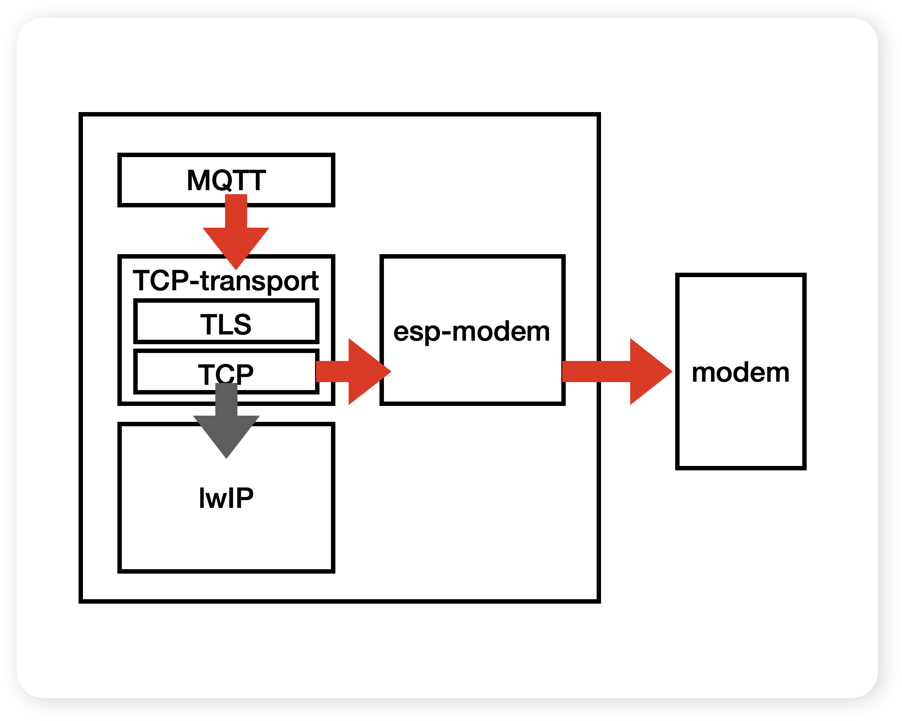
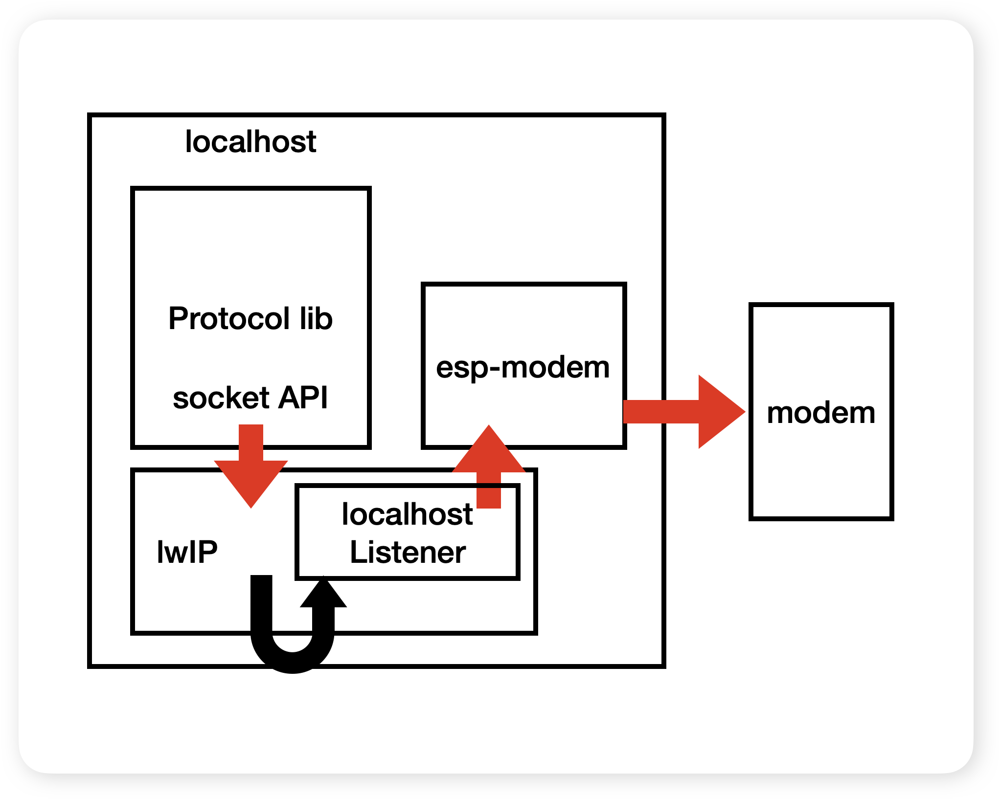

# Modem TCP client

(See the README.md file in the upper level 'examples' directory for more information about examples.)

## Overview
This example demonstrates how to act as a MQTT client using modem's TCP commands (provided, the device supports "socket" related commands)

This example could be used in two different configurations:
1) Custom TCP transport: Implements a TCP transport in form of AT commands and uses it as custom transport for mqtt client.
2) Localhost listener: Uses standard transports to connect and forwards socket layer data from the client to the modem using AT commands.

### Custom TCP transport

This configuration expects that the network library, that is used to communicate with the endpoint uses `tcp_transport` component. In this example, we use `esp-mqtt` which supports custom transports so that we can implement a transport layer that communicate on TCP layer using AT commands. If we want to use TLS, we could add an SSL layer on top of this TCP layer.

To enable this mode, please set `EXAMPLE_CUSTOM_TCP_TRANSPORT=y`

### Localhost listener

This configuration could be used with any network library, which is connecting to a localhost endpoint instead of remote one. This example creates a localhost listener which basically mimics the remote endpoint by forwarding the traffic between the library and the TCP/socket layer of the modem (which is already secure if the TLS is used in the network library)

